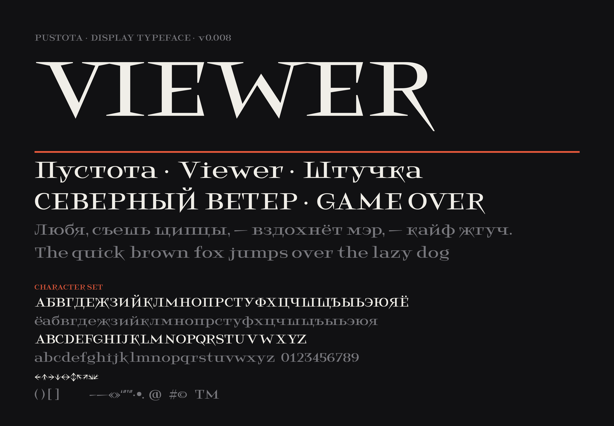

# VTF Viewer

An experimental display typeface by [Pustota](https://pustota.name) with Latin and Cyrillic support.



[](LICENSE)
[](https://github.com/Bloorgard/Empty-Fonts-Viewer/releases/latest)

---

## Download

Grab the latest packaged fonts from the **[Releases](https://github.com/Bloorgard/Empty-Fonts-Viewer/releases/latest)** page,
or use the files directly from [`fonts/`](fonts):

| Format | File | Use for |
| --- | --- | --- |
| OTF | [`VTFViewer-Regular.otf`](fonts/VTFViewer-Regular.otf) | Desktop apps, print |
| WOFF2 | [`VTFViewer-Regular.woff2`](fonts/VTFViewer-Regular.woff2) | Web (modern browsers) |
| WOFF | [`VTFViewer-Regular.woff`](fonts/VTFViewer-Regular.woff) | Web (fallback) |

## Install

**macOS** — double-click `VTFViewer-Regular.otf` and press *Install Font*.
**Windows** — right-click the `.otf` and choose *Install*.
**Linux** — copy the `.otf` into `~/.local/share/fonts/` and run `fc-cache -f`.

## Use on the web

```css
@font-face {
  font-family: "VTF Viewer";
  src: url("fonts/VTFViewer-Regular.woff2") format("woff2"),
       url("fonts/VTFViewer-Regular.woff")  format("woff");
  font-weight: 400;
  font-style: normal;
  font-display: swap;
}

h1 {
  font-family: "VTF Viewer", serif;
}
```

## Source

The typeface is designed in [Glyphs](https://glyphsapp.com). The editable source lives in
[`sources/`](sources) and is the single source of truth — the `fonts/` files are exported from it.

## Building a release

Fonts are exported manually from Glyphs, then packaged with the helper script:

```bash
# 1. In Glyphs: export OTF + WOFF + WOFF2, and save the .glyphs source
# 2. From the repo root:
./release.sh
```

`release.sh` moves the exported files into place, renames them to stable names, reads the
version from the source, commits, tags `vX.Y.Z`, and publishes a GitHub Release with a
zipped font package. See the top of the script for details.

To refresh the specimen image after design changes:

```bash
pip install uharfbuzz freetype-py fonttools Pillow
python3 tools/render_specimen.py
```

The sample text, sizes and colors live in the `EDIT ME` block at the top of the
script; the character-set block is read straight from the font, so it always
matches what the font actually contains.

## License

This font is licensed under the **SIL Open Font License, Version 1.1**.
You may use, study, modify and redistribute it freely, including in commercial work —
you just may not sell the font by itself. See [`LICENSE`](LICENSE) and [`FONTLOG.txt`](FONTLOG.txt).

*Copyright © 2024 Pustota, with Reserved Font Name “VTF Viewer”.*
